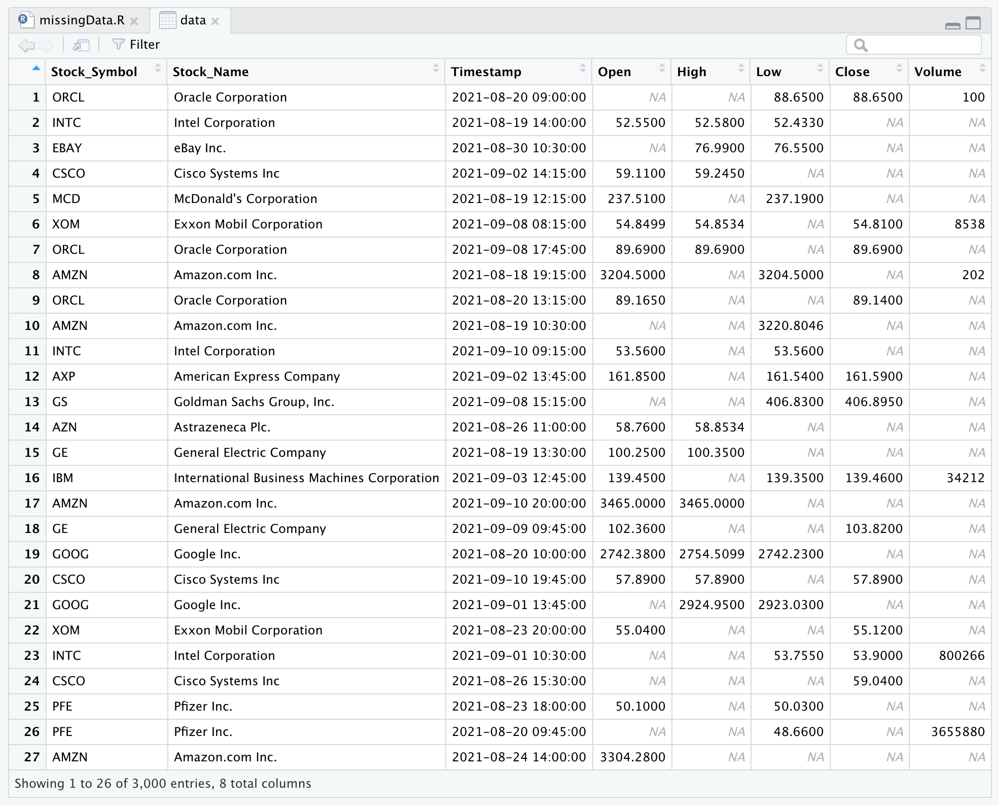
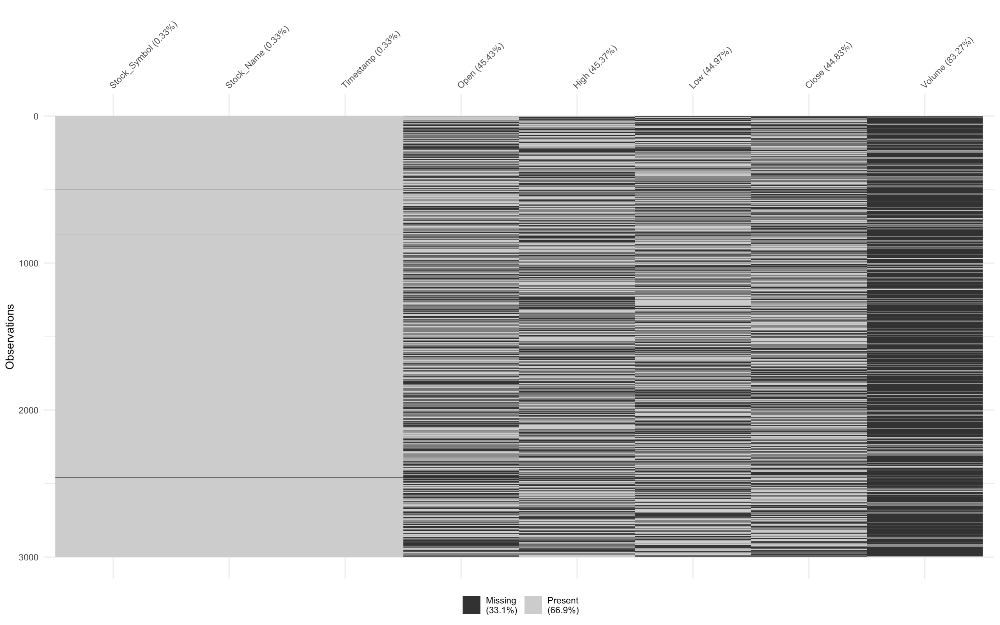
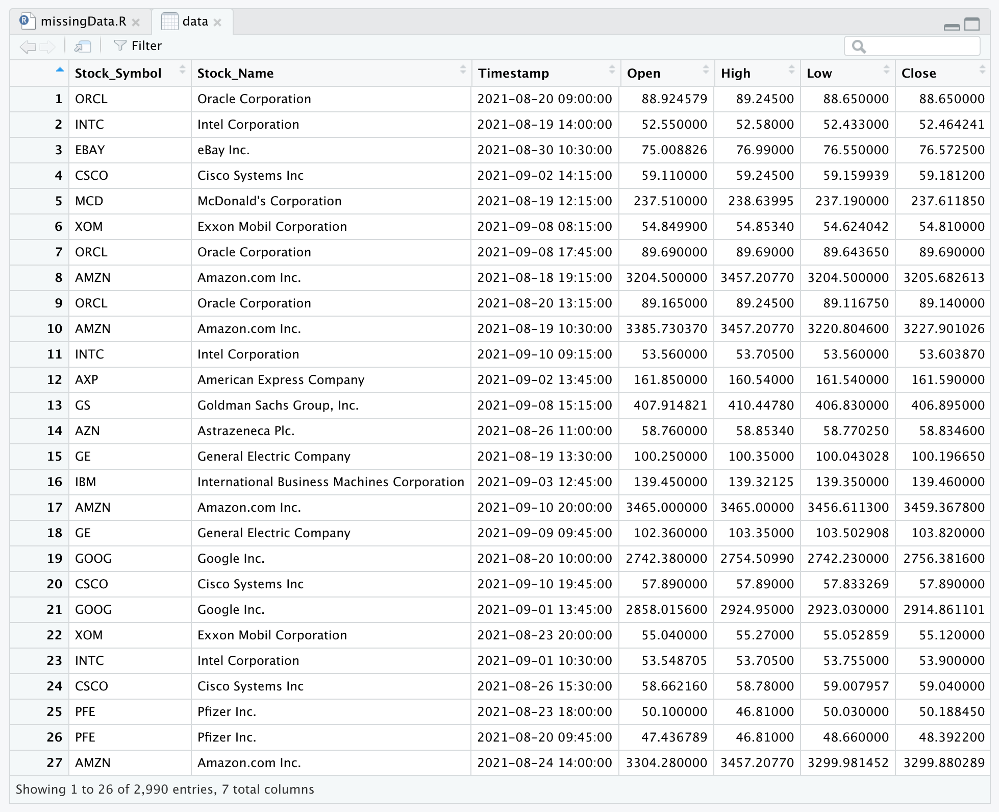

# Data Preprocessing and Wrangling

## Question 

<b>

You are requested to use data set which you have created during Activity-1. If the
data set does not have missing data or enough data (Data set should have minimum
200 Rows), you can obtain random data set from internet. If there are no missing
values, you can randomly remove some of the values and create missing data set.
Then apply the following algorithms for dropping or imputing missing data,
(Note: You can either directly read the data set from URL or upload and read from
your GITHUB repository)

<ol>
<li>Remove the columns and rows having missing data more than 60% </li>
<li>Apply Mean or Median for Imputing Missing Values in remaining columns </li>
<li>Apply any other standard algorithm for imputing missing values (for at least
one column). </li>
</ol>

<h4>Rubrics</h4>
<ul>
<li>Obtaining Data set from internet resources and creating missing values </li>
<li>Remove the columns/rows having missing data more than 60% </li>
<li>Mean or Median Imputation </li>
<li>Standard Algorithm </li>
<li>Explanation of algorithms in R comments itself </li>
</ul>

</b>
  

  
<b>View Solution</b>

  
<h4>Dataset Used: </h4>
<b>
<a href="https://github.com/rushabhkela/Data-Science-with-R/blob/main/Part%203/dataset.csv">Dataset</a>
</b>

<h4>R Script:</h4>
<b>The code is self-explanatory and is written step-by-step with all the necessary comments. It is recommended that you view the solution only after trying the above activity on your own.
 
<a href="https://github.com/rushabhkela/Data-Science-with-R/blob/main/Part%203/solution.R"><b>Code</b></a>

<h4>Outputs (Dataset and Plots): <h4>
<h3>Missing dataset</h3>

  
<h3>Visualising the missing values</h3>

  
<h3>Imputed dataset</h3>

 

