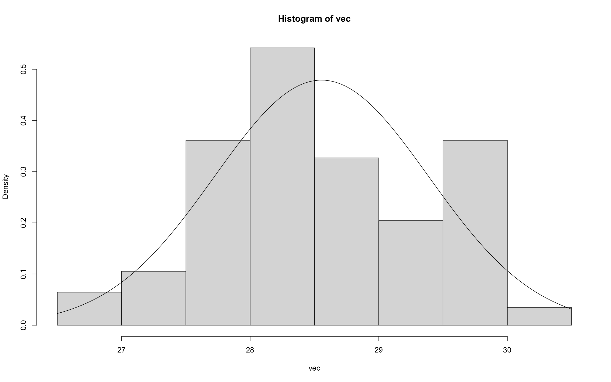

# Statistical Methods and Hypothesis Testing

## Question 

<b>

The aim of this activity is to understand the various statistical methods and
empirical rule. You can use the same data set which was used for Missing Data
Imputation. You are expected to analyse the data without using any
predefined R functions (You have to use user-defined functions for ALL
methods expect plots and graphs - E.g. Do not use predefined function mean()
instead of writing your own function with simple loop class_mean())
<ol>
<li>Find Mean </li>
<li>Find Median </li>
<li>Find Mode </li>
<li>Find IQR </li>
<li>Find Standard Deviation </li>
<li>Find Probability values on Empirical Rule </li>
<li>Plot the Graph/Histogram/Normal Distribution and Compare your
functions return value with predefined functions in R for mean, median,
IQR, and sd. </li>
<li>Formulate the Null Hypothesis and Alternative Hypothesis for your data
set and prove it based on the p-value. </li>
</ol>
</b>
  

  
<b>View Solution</b>

  
<h4>Dataset Used: </h4>
<b>
<a href="https://github.com/rushabhkela/Data-Science-with-R/blob/main/Part%201/StockData.csv">Dataset</a>
</b>

<h4>R Script:</h4>
<b>The code is self-explanatory and is written step-by-step with all the necessary comments. It is recommended that you view the solution only after trying the above activity on your own.
 
<a href="https://github.com/rushabhkela/Data-Science-with-R/blob/main/Part%204/solution.R"><b>Code</b></a>

<h4>Outputs (Plots): <h4>
<h3>HPQ Vector Visualisation and Statistical Analysis Plots</h3>

  
<h3>Hypothesis Testing</h3>
<h4>Data Sample (Johnson & Johnson and Toyota Motors High Intraday Prices</h4>

 
<h4>t-Test Result</h4>

 
 
<h4>Visualising the t-Test Result</h4>

 

