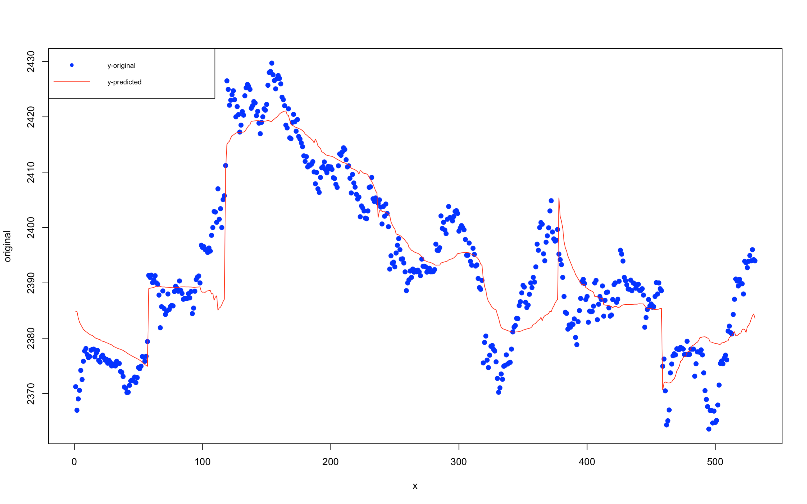
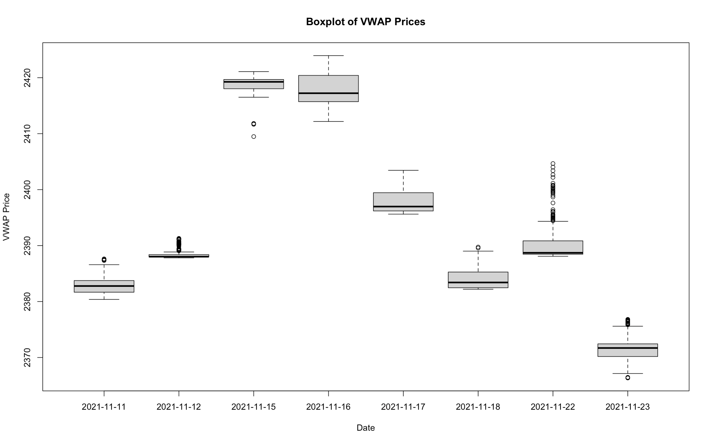
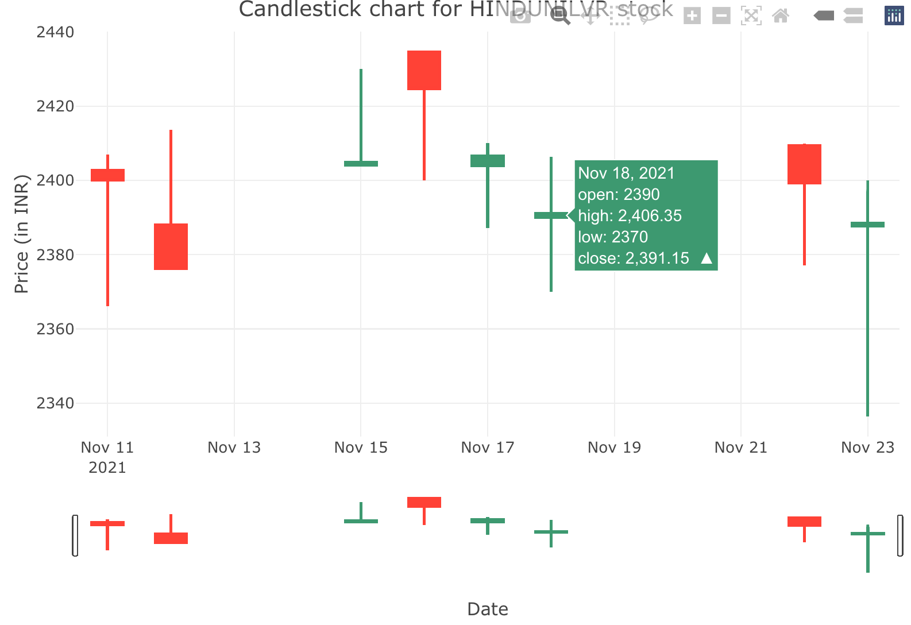
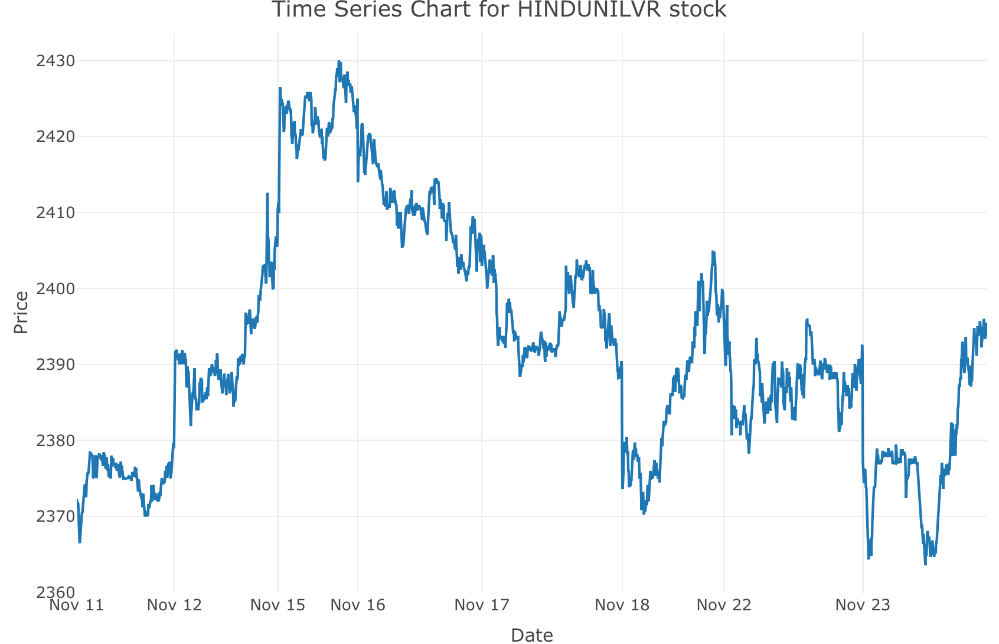

# Modelling, Evaluation and Visualisation

## Question
`Topic: Multivariate Linear Regression`

### Task-1 Data set creation 
Build a data set for the Indian NSE Stock price of a particular share for 14
days.
Write a detailed description of your dataset in VPL Editor itself using R comments.

### Task-2 Data set creation 
* Preprocess and clean your data
* Apply the Model according to your assignment

### Task-3 Model Evaluation 
* Preprocess and clean your data
* Apply the Model according to your assignment

### Task-4 Data Visualisation


<br>
<br>
<br>


## Building the dataset

<h3>Stock</h3>
<b style="font-size: 30px">
 
Name : Hindustan Unilever Limited
 <br>
Symbol : `HINDUNILVR`
  <br>
Live NSE Market Prices fetched using `jugaad-data` Python Library
 
</b>

### Fetching the data
* Install the library
  ```sh
  pip3 install jugaad-data
  ```
* Run the code at 09:15 A.M. (Monday - Friday) and stop execution at 03:30 P.M.

The below code runs an infinite loop once started and sleeps for 60 seconds
after every iteration. Hence the live data of `HINDUNILVR` stock is fetched from
the NSELive() function of `jugaad-data` library.
Since the data returned is in JSON format having nested JSON object, the
functions `normalize_json`, `generate_csv_data` convert it into the desired
format.


```py
import json
import csv
import time
from jugaad_data.nse import NSELive
from datetime import datetime

 
def normalize_json(data: dict) -> dict:
    new_data = dict()
    for key, value in data.items():
        if not isinstance(value, dict):
            new_data[key] = value
        else:
            for k, v in value.items():
                new_data[key + "_" + k] = v

    return new_data


def generate_csv_data(data: dict) -> str:
    csv_columns = data.keys()
    csv_data = ""
    new_row = list()
    for col in csv_columns:
        new_row.append(str(data[col]))
    csv_data += ",".join(new_row) + "\n"

    return csv_data


def write_to_file(data: str, filepath: str) -> bool:
    try:
        with open(filepath, "a+") as f:
            f.write(data)
    except:
        raise Exception(f"Saving data to {filepath} encountered an error")


def main():
    n = NSELive()
    q = n.stock_quote("HINDUNILVR")
    data = q['priceInfo']
    now = datetime.now()
    now = now.strftime("%d/%m/%Y %H:%M:%S")
    data['timestamp'] = now
    new_data = normalize_json(data=data)
    print("New dict:", new_data)
    csv_data = generate_csv_data(data=new_data)
    write_to_file(data=csv_data, filepath="stockdata.csv")


if __name__ == '__main__':
    while True:
        main()
        time.sleep(60)
```
 
 
 ## Sample Data :
 
 

 
 ## Model to be applied :
 ## MULTIVARIATE LINEAR REGRESSION 
Multivariate Regression is a supervised machine learning algorithm involving
multiple data variables for analysis. A Multivariate regression is an extension of
multiple regression with one dependent variable and multiple independent
variables. Based on the number of independent variables, we try to predict the
output.


<details>
  <summary><b>View Solution</b></summary>
  
<h4>Dataset Used: </h4>
<b>
<a href="https://github.com/rushabhkela/Data-Science-with-R/blob/main/Part%205/NSEdataset.csv">Dataset</a>
</b>

<h4>R Script:</h4>
<b>The code is self-explanatory and is written step-by-step with all the necessary comments. It is recommended that you view the solution only after trying the above activity on your own.
<br>
<a href="https://github.com/rushabhkela/Data-Science-with-R/blob/main/Part%205/solution.R"><b>Code</b></a>

<h4>Outputs (Plots): <h4>
<h3>Model Visualisation</h3>

<br><br>
<h3>Visualisation Plots</h3>
<h4>Boxplot</h4>

<br>
<h4>Candlestick Chart</h4>

<br>
<br>
<h4>Timeseries Plot</h4>

<br>

</details>


